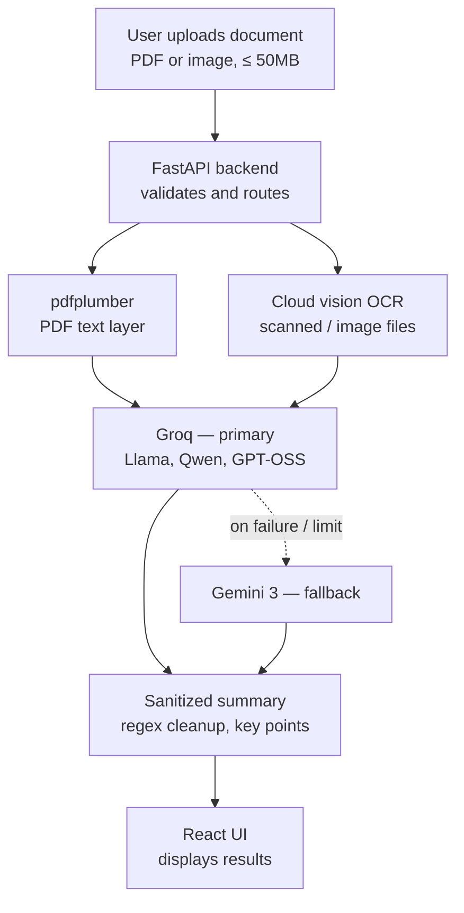

# 📄 Document Summary Assistant

**AI-powered document summarizer** that extracts text from PDFs and scanned images and turns it into clean, structured summaries with key bullet points. Built for speed with **Groq**, backed by **Google Gemini 3** as an automatic fallback.

<p>
  
  
  
  
  
</p>

> 📘 **Full project report:** [Architecture & Technical Overview (PDF)](https://drive.google.com/file/d/1TShImG7Nv7o1ouw_jvYr_QwA3NWy_Qj0/view?usp=sharing)

---

## Table of Contents

- [Features](#features)
- [Tech Stack](#tech-stack)
- [Architecture & Data Flow](#architecture--data-flow)
- [Local Setup](#local-setup)
- [Deployment](#deployment)
- [Limitations](#limitations)
- [License](#license)

---

## Features

| | |
|---|---|
| 🗂️ **Multi-Format Support** | Standard PDFs, scanned documents, and images (`.png`, `.jpg`, `.jpeg`, `.webp`) up to **50 MB** |
| ☁️ **Cloud-Native OCR** | Zero OS-level binary dependencies — no local Tesseract install, works in any cloud or client environment |
| ⚡ **Dual-Model Architecture** | Primary: high-speed inference via **Groq** (`openai/gpt-oss-20b`, `qwen/qwen3.6-27b`, `llama-3.1-8b-instant`) · Fallback: **Gemini 3** (`gemini-3.7-flash`, `gemini-3.6-flash`) |
| 🔄 **Interactive Length Switching** | Toggle between **Short**, **Medium**, and **Long** summaries with instant re-generation |
| ✨ **Clean Markdown Output** | Automatic sanitization of reasoning tags, thinking traces, and formatting artifacts |
| 🌓 **Dark & Light Mode** | Sleek SaaS UI with copy-to-clipboard and drag-and-drop upload |

---

## Tech Stack

**Backend:** FastAPI · Python 3.11+ · pdfplumber · Pillow · Google Generative AI SDK · Groq / OpenAI REST API

**Frontend:** React + Vite · Vanilla CSS design tokens (no heavy CSS framework)

**Deployment:** Render (backend API) · Vercel (frontend UI)

---

## Architecture & Data Flow



---

## Local Setup

### 1. Backend

```bash
cd backend
python -m venv venv

# Windows
venv\Scripts\activate
# macOS/Linux
source venv/bin/activate

pip install -r requirements.txt
cp .env.example .env   # add GROQ_API_KEY and GEMINI_API_KEY
uvicorn main:app --reload --port 8000
```

### 2. Frontend

```bash
cd frontend
npm install
echo "VITE_API_BASE_URL=http://localhost:8000" > .env
npm run dev
```

### 3. Run everything at once (Windows)

Double-click **`run.bat`** in the project root to start the backend and frontend together.

---

## Deployment

### Backend → Render

1. Create a **New Web Service** from your GitHub repo.
   - **Root Directory:** `backend`
   - **Build Command:** `pip install -r requirements.txt`
   - **Start Command:** `uvicorn main:app --host 0.0.0.0 --port $PORT`
2. Add environment variables:

   | Variable | Value |
   |---|---|
   | `GROQ_API_KEY` | Your Groq API key |
   | `GEMINI_API_KEY` | Your Gemini API key |
   | `ALLOWED_ORIGINS` | `*` |

### Frontend → Vercel

1. Import your GitHub repo.
   - **Root Directory:** `frontend`
   - **Framework Preset:** `Vite`
2. Add environment variable:

   | Variable | Value |
   |---|---|
   | `VITE_API_BASE_URL` | `https://your-render-backend.onrender.com` |

---

## Limitations

- **Context window:** ~60,000 characters (~15,000 words) — large multi-chapter documents are truncated rather than processed via RAG.
- **Stateless:** no database or auth; summaries live in-memory and reset on page reload.
- **File formats:** PDF and image formats only — Office documents (`.docx`, `.pptx`, `.xlsx`) need prior conversion.
- **Third-party dependency:** requires active `GROQ_API_KEY` and `GEMINI_API_KEY`; rate limits or outages on either provider affect availability.
- **Upload cap:** 50 MB per file, to protect memory on free-tier hosting.

---

## License

MIT — feel free to fork and adapt.