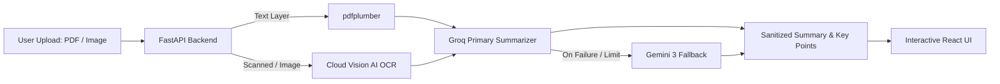

# Document Summary Assistant

An AI-powered document summarizer that extracts text from PDFs and scanned images, providing structured summaries with key bullet points. Powered by **Groq** for high-speed inference with automatic fallback to **Google Gemini 3**.

> 📄 **Project Architecture & Technical Overview Report (PDF):**  
> View the complete project report on [**Google Drive**](https://drive.google.com/file/d/1TShImG7Nv7o1ouw_jvYr_QwA3NWy_Qj0/view?usp=sharing).

---

## Features

- **Multi-Format Support:** Handles standard PDFs, scanned documents, and images (`.png`, `.jpg`, `.jpeg`, `.webp`) up to **50 MB**.
- **Cloud-Native AI OCR:** Zero OS-level binary dependencies (no local Tesseract installation needed) — works seamlessly in any cloud or client environment.
- **Dual-Model Architecture:**
  - **Primary:** High-speed inference via **Groq** (`openai/gpt-oss-20b`, `qwen/qwen3.6-27b`, `llama-3.1-8b-instant`).
  - **Fallback:** Google **Gemini 3** (`gemini-3.7-flash`, `gemini-3.6-flash`).
- **Interactive Length Switching:** Switch between **Short**, **Medium**, and **Long** summaries directly from the results screen with instant re-generation.
- **Clean Markdown Formatting:** Automatic sanitization of reasoning tags, thinking traces, and formatting artifacts.
- **Dark & Light Mode:** Sleek SaaS UI with copy-to-clipboard functionality and drag-and-drop file upload.

---

## Tech Stack

- **Backend:** FastAPI, Python 3.11+, pdfplumber, Pillow, Google Generative AI, Groq / OpenAI REST API.
- **Frontend:** React + Vite, Vanilla CSS design tokens (zero heavy CSS framework bloat).
- **Deployment:** Render (Backend API) & Vercel (Frontend UI).

---

## Local Setup

### 1. Backend Setup

```bash
cd backend
python -m venv venv

# On Windows:
venv\Scripts\activate
# On macOS/Linux:
source venv/bin/activate

pip install -r requirements.txt
cp .env.example .env   # Fill in your GROQ_API_KEY and GEMINI_API_KEY
uvicorn main:app --reload --port 8000
```

### 2. Frontend Setup

```bash
cd frontend
npm install
# Create local env file:
echo "VITE_API_BASE_URL=http://localhost:8000" > .env
npm run dev
```

### 3. Run Everything Together (Windows)
Double-click the **`run.bat`** script in the project root to start both the backend and frontend simultaneously.

---

## Deployment

### Backend → Render
1. Create a **New Web Service** from your GitHub repository.
   - **Root Directory:** `backend`
   - **Build Command:** `pip install -r requirements.txt`
   - **Start Command:** `uvicorn main:app --host 0.0.0.0 --port $PORT`
2. Under **Environment Variables**, add:
   - `GROQ_API_KEY`: Your Groq API key
   - `GEMINI_API_KEY`: Your Gemini API key
   - `ALLOWED_ORIGINS`: `*`

### Frontend → Vercel
1. Import your GitHub repository into **Vercel**.
   - **Root Directory:** `frontend`
   - **Framework Preset:** `Vite`
2. Under **Environment Variables**, add:
   - `VITE_API_BASE_URL`: `https://your-render-backend.onrender.com`

---

## Architecture & Data Flow



